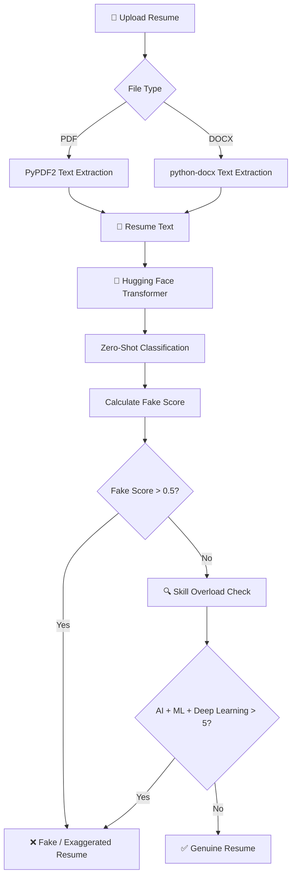

# 🧠 Resume Integrity Analyzer

An **AI-powered resume screening system** that analyzes uploaded resumes and classifies them as **Genuine** or **Fake / Exaggerated** using **Natural Language Processing (NLP)** and **zero-shot text classification**.

The system accepts **PDF and DOCX resumes**, extracts their text, analyzes the content using a **Hugging Face Transformer model**, and produces a final classification with a confidence score.

---

## ✨ Features

* 📄 Supports **PDF and DOCX** resumes
* 📝 Automatic resume text extraction
* 🤖 AI-based **zero-shot resume classification**
* 🔍 Identifies potentially exaggerated skill claims
* 📊 Generates classification confidence scores
* ✅ Classifies resumes as:

  * **Genuine Resume**
  * **Fake / Exaggerated Resume**
* ☁️ Runs directly in **Google Colab**

---

## 🔄 Project Workflow



---

## 🧠 How It Works

### 1. 📄 Resume Upload

The system accepts resumes in the following formats:

* `.pdf`
* `.docx`

The notebook uses **Google Colab's file upload functionality** to upload the resume.

### 2. 📝 Text Extraction

The uploaded resume is converted into plain text.

**PDF files:**

```python
PyPDF2.PdfReader()
```

**DOCX files:**

```python
Document()
```

The extracted text from all pages or paragraphs is combined before analysis.

### 3. 🤖 AI Classification

The extracted resume text is passed to a **Hugging Face Transformers zero-shot classification pipeline**.

The project uses:

```text
facebook/bart-large-mnli
```

with the following candidate labels:

```text
Genuine resume
Fake or exaggerated resume
```

The model returns a confidence score for each label.

### 4. 📊 Fake Score Analysis

The confidence score associated with:

```text
Fake or exaggerated resume
```

is extracted.

If:

```text
Fake Score > 0.5
```

the resume is classified as:

**Fake / Exaggerated Resume ❌**

Otherwise, the system proceeds to the additional skill-overload check.

### 5. 🔍 Skill Overload Check

The system also performs a simple rule-based analysis by counting occurrences of:

* Machine Learning
* Deep Learning
* AI

If the combined count is greater than **5**, the resume is flagged as potentially exaggerated.

Otherwise, it is classified as:

**Genuine Resume ✅**

---

## 📊 Dataset

The notebook loads a dataset containing approximately **3,500 resumes**.

The dataset is read from **JSON / line-based JSON data**, and the resume entries are converted into text for processing.

> **Note:** The current implementation uses the dataset primarily for loading and inspection. The final prediction is performed using **zero-shot classification** rather than training a custom classifier on the 3,500 samples.

---

## 🛠️ Tech Stack

| Technology                       | Purpose                               |
| -------------------------------- | ------------------------------------- |
| 🐍 **Python**                    | Core programming language             |
| 🤗 **Hugging Face Transformers** | NLP and zero-shot classification      |
| 🧠 **BART-large-MNLI**           | Pre-trained language model            |
| 📄 **PyPDF2**                    | PDF text extraction                   |
| 📝 **python-docx**               | DOCX text extraction                  |
| ☁️ **Google Colab**              | Development and execution environment |
| 📦 **JSON**                      | Resume dataset processing             |

---

## 📁 Project Structure

```text
Resume-Integrity-Analyzer/
│
├── Untitled2.ipynb
└── README.md
```

The main implementation is contained in the **Jupyter / Google Colab notebook**.

---

## ▶️ How to Run

### Option 1 — Google Colab

1. Open the project notebook in Google Colab.
2. Run the cells sequentially.
3. Upload a **PDF or DOCX resume** when prompted.
4. Review the extracted text, classification scores, and final result.

### Option 2 — Local Jupyter Environment

Install the required packages:

```bash
pip install transformers python-docx PyPDF2
```

Then open:

```text
Untitled2.ipynb
```

Run the notebook cells in order and upload a PDF or DOCX resume when prompted.

---

## 🧪 Example Result

For a sample resume, the model produced:

| Classification            | Confidence |
| ------------------------- | ---------: |
| **Genuine Resume**        | **94.94%** |
| Fake / Exaggerated Resume |      5.06% |

### Final Result

**Genuine Resume ✅**

This demonstrates the complete flow:

```text
Resume Upload
      ↓
Text Extraction
      ↓
AI Classification
      ↓
Confidence Score
      ↓
Skill Overload Check
      ↓
Final Result
```

---

## 🚀 Future Improvements

The current implementation can be extended into a more complete resume verification system by adding:

* 📊 Supervised ML classification using the available resume dataset
* 🧹 Advanced NLP preprocessing
* 🎯 Skill-to-job-description matching
* 📌 Resume section validation
* 🔎 Duplicate / copied resume detection
* 📈 Explainable AI to show why a resume was flagged
* 🌐 Web interface using Flask or Streamlit
* 📊 Recruiter dashboard
* 🗂️ Resume database and history tracking

---

## ⚠️ Limitations

This project is an **experimental resume screening tool** and should not be treated as a definitive method for determining whether a resume is truthful.

The zero-shot model evaluates the supplied resume text based on the provided classification labels, while the skill-overload analysis uses a **simple rule-based heuristic**.

Therefore, the classification should be considered an **AI-assisted indication rather than a verified judgment of resume authenticity**.

---

## 🔗 Google Colab

### ▶️ [Open Project in Google Colab](https://colab.research.google.com/drive/1VR5a8qg9yh_LiIRQLNKKkEYexHJtcSY1?usp=sharing)

Run the complete project directly in Google Colab without requiring local setup.

---

## 👩‍💻 Author

**Rupanjali Garlapati**

Computer Science and Engineering
CMR College of Engineering & Technology
